<p align="right">
   <a href="./README.md">EN</a> | <a href="./README.zh-CN.md">简</a> | <a href="./README.zh-TW.md">繁</a> | <a href="./README.ko.md">KO</a> | <a href="./README.ja.md">JA</a> | <strong>PT</strong>
</p>
<div align="center">
    
    <h1>Token Monitor</h1>
</div>

<p align="center">
    <em>Um painel ao vivo para cada ferramenta de programação com IA, sincronizado entre todas as máquinas.</em>
</p>

<p align="center">
    <a href="https://github.com/Javis603/token-monitor/releases"></a>
    <a href="https://github.com/Javis603/token-monitor/releases"></a>
    
    
    
    <a href="https://discord.gg/HmdNVVvw5P"></a>
    <a href="LICENSE"></a>
</p>

<div align="center">
    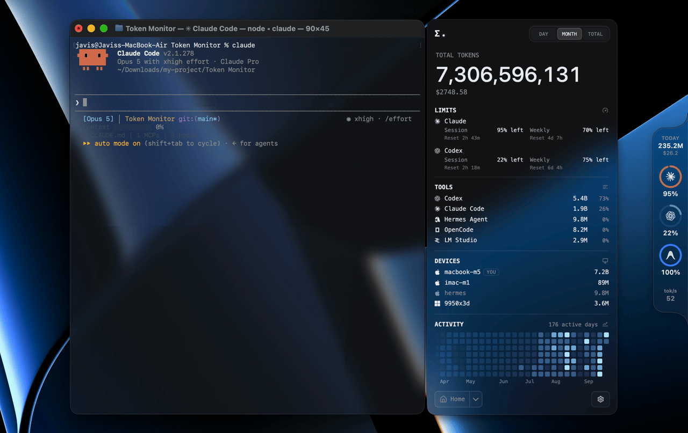
</div>

## O que é o Token Monitor?

Um widget de desktop que mostra o uso de tokens ao vivo e os Limites de Ferramentas de IA em 43+ ferramentas de programação com IA — Claude Code, Codex, Cursor, GitHub Copilot, Cherry Studio e muitas outras — com sincronização multidispositivo em tempo real, tendências de uso histórico e detalhamentos por ferramenta, dispositivo, modelo, sessão ou projeto.

## Ferramentas suportadas

O Token Monitor suporta uso de tokens, verificação de limites da conta e detalhes de sessão separadamente:

| Logo | Ferramenta | Caminho dos dados | Uso de tokens | Limites de ferramentas de IA | Detalhes da sessão |
|:---:|------|-----------|:---:|:---:|:---:|
|  | Claude Code | `~/.claude/projects/`, `~/.claude/transcripts/` | ✅ | ✅ | ✅ |
|  | Codex | `~/.codex/` (`sessions/`, `archived_sessions/`) | ✅ | ✅ | ✅ |
|  | OpenCode | `~/.local/share/opencode/` (`opencode*.db`, `storage/message/`) | ✅ | ✅ | ✅ |
|  | Hermes Agent | `~/.hermes/state.db` | ✅ | — | — |
|  | OpenClaw | `~/.openclaw/agents/` | ✅ | — | — |
|  | Cursor IDE / Cursor CLI / Grok Bot | `~/.config/tokscale/cursor-cache/` (account-level usage export) | ✅ | ✅ | — |
|  | Antigravity | `~/.gemini/` (`antigravity/`, `antigravity-ide/`, `antigravity-backup/`, `antigravity-cli/conversations/`) | ✅ | ✅ | — |
|  | Cline | VS Code globalStorage tasks (`.../saoudrizwan.claude-dev/tasks/`), `~/.cline/data/sessions/` | ✅ | ✅ | — |
| 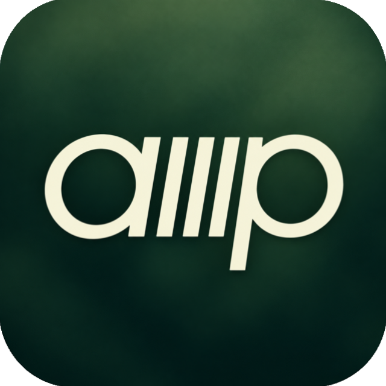 | Amp | `~/.local/share/amp/threads/` | ✅ | — | — |
| 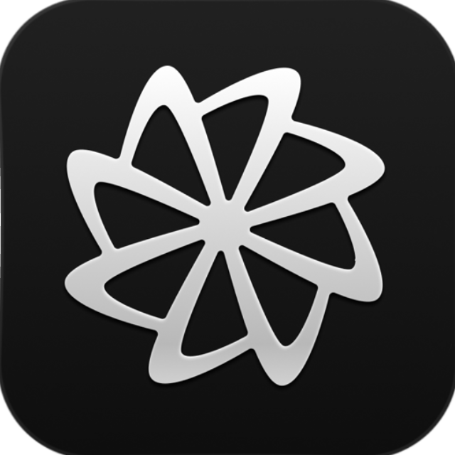 | Factory Droid | `~/.factory/sessions/` | ✅ | ✅ | — |
|  | Kimi CLI / Kimi Code / Kimi Work | `~/.kimi/sessions/`, `~/.kimi-code/sessions/`, `<platform-app-data>/kimi-desktop/` | ✅ | ✅ | — |
|  | Qwen CLI | `~/.qwen/projects/` | ✅ | — | — |
|  | Grok Build | `~/.grok/` (`sessions/`, `logs/unified.jsonl`) | ✅ | ✅ | — |
|  | GitHub Copilot | VS Code `workspaceStorage/*/chatSessions/`, `~/.copilot/` (`otel/`, `data.db`, `session-store.db`) | ✅ | ✅ | — |
|  | Pi | `~/.pi/agent/sessions/` | ✅ | — | — |
| 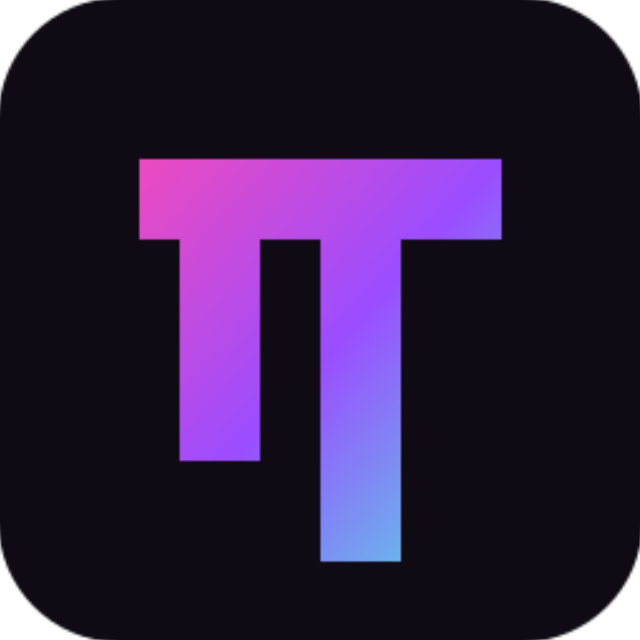 | Oh My Pi | `~/.omp/agent/sessions/` | ✅ | — | — |
|  | Zed | `~/.local/share/zed/threads/threads.db` | ✅ | ✅ | — |
| 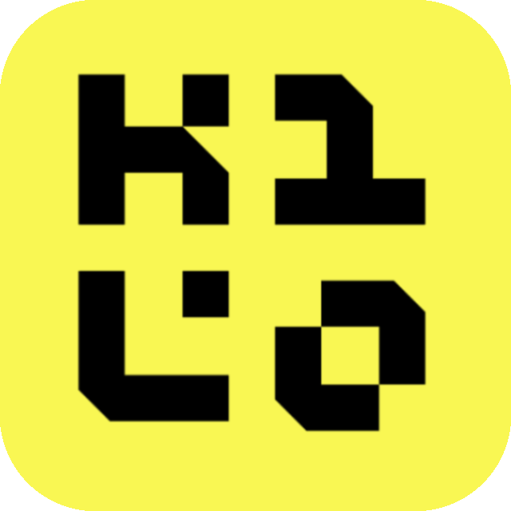 | Kilo | `~/.local/share/kilo/kilo.db`; tarefas do globalStorage do VS Code (`.../kilocode.kilo-code/tasks/`) — logs da extensão apenas no Linux e remoto/WSL | ✅ | — | — |
|  | Command Code | `~/.commandcode/projects/**/*.jsonl` | ✅ | ✅ | — |
| 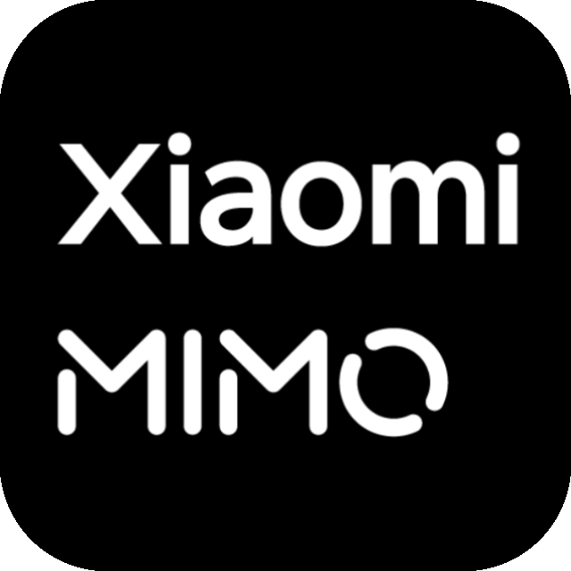 | MiMo Code / MiMo Desktop | `~/.local/share/mimocode/mimocode.db` | ✅ | ✅ | — |
| 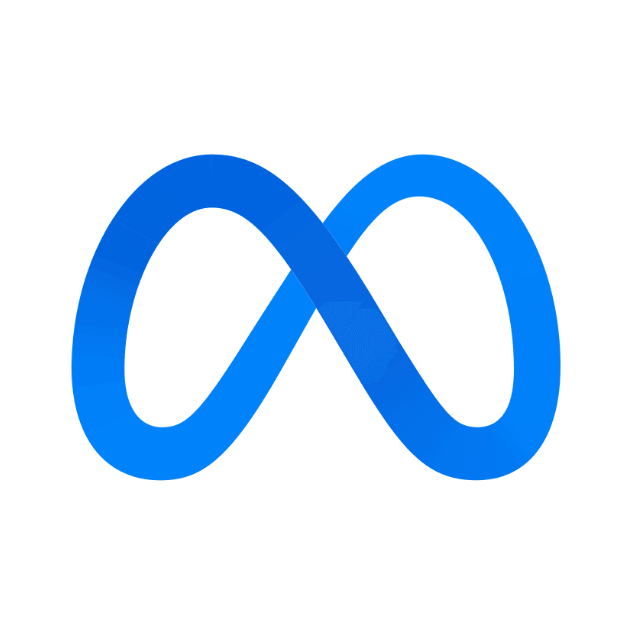 | Muse Code | `~/.local/share/muse/sessions/` | ✅ | — | — |
|  | ZCode / GLM | `~/.zcode/` (`projects/`, `cli/db/db.sqlite`) | ✅ | ✅ | — |
|  | Kiro | `~/.kiro/sessions/cli/`, Kiro IDE globalStorage & `kiro-cli` DB | ✅ | ✅ | — |
|  | CodeBuddy | `~/.codebuddy/projects/` + IDE / VS Code extension logs | ✅ | — | ✅ |
|  | WorkBuddy | `~/.workbuddy/projects/`, `~/.workbuddy/workbuddy.db` | ✅ | ✅ | ✅ |
|  | Proma | `~/.proma/agent-sessions/*.jsonl` | ✅ | — | — |
|  | Qoder | `~/.qoder-cn/projects/**/*.jsonl`, legado `<platform-app-data>/QoderCN/SharedClientCache/cache/db/local.db` (somente CN) | ✅ | ✅ | — |
|  | Reasonix | `~/.reasonix/` (`stats/`, `sessions/`, `projects/*/sessions/`) | ✅ | — | — |
|  | DeepSeek / DeepSeek Harness | `~/.dsh/sessions/` (`session.jsonl`, `session.jsonl.zstd`) | ✅ | ✅ | ✅ |
|  | Cherry Studio | `<platform-app-data>/CherryStudio/` (`Data/Agents/.claude/projects/` V2, `.claude/projects/` legado) | ✅ | — | — |
|  | LM Studio | `~/.lmstudio/server-logs/**/*.log` | ✅ | — | — |
| 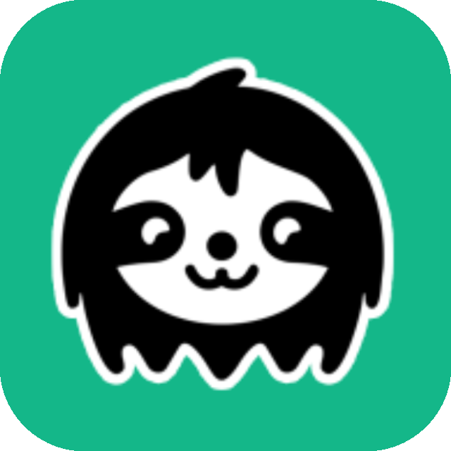 | Unsloth Studio | `~/.unsloth/studio/studio.db` | ✅ | — | — |
| 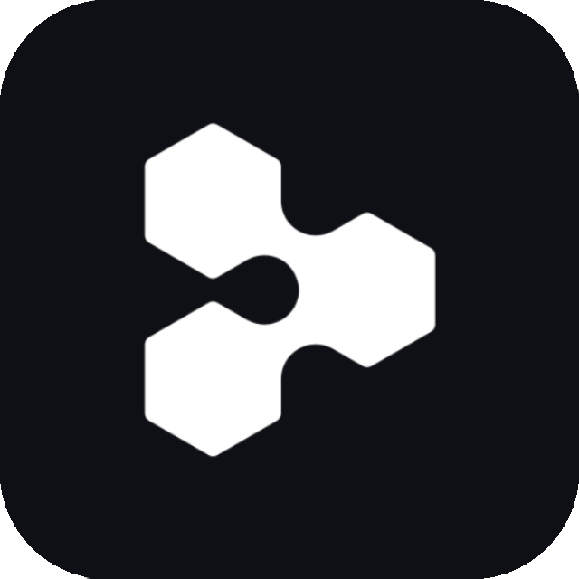 | Devin CLI / Devin Desktop | `~/.local/share/devin/cli/sessions.db`, `<platform-app-data>/Devin/User/acp-events/` | ✅ | ✅ | — |
|  | fx | `~/.fx/sessions/` | ✅ | — | — |
|  | MiniMax / MiniMax Code | `~/.minimax/v2/sessions/` | ✅ | ✅ | — |
| 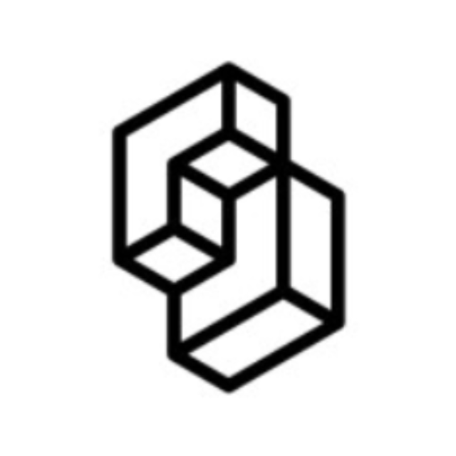 | TypeSafe | Cookie do TypeSafe Console (saldo de cobrança e gasto estimado em tokens via dados de uso) | — | ✅ | — |
|  | OpenRouter | Chave de API do OpenRouter (uso/limite da chave; saldo quando o acesso a créditos é autorizado, documentado para chaves Management) | — | ✅ | — |
|  | Volcengine | Chave de API do Ark ou AK/SK da Volcengine (cota do Ark Coding Plan e do Agent Plan via API da Volcengine) | — | ✅ | — |
|  | Ollama | Cookie do Ollama Cloud (uso de sessão/semanal via ollama.com/settings) | — | ✅ | — |
|  | Trae CN | Token de acesso do Trae CN (créditos do Trae CN / SOLO via trae.cn) | — | ✅ | — |
| 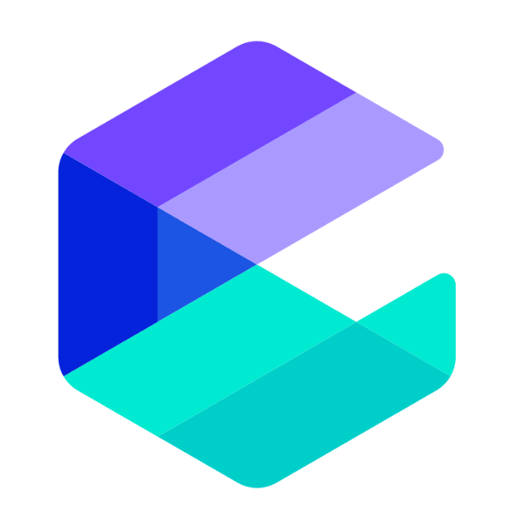 | Alibaba Cloud | Cookie do console da Alibaba Cloud (cota do Token Plan do Bailian / Model Studio, Team e Personal) | — | ✅ | — |
| 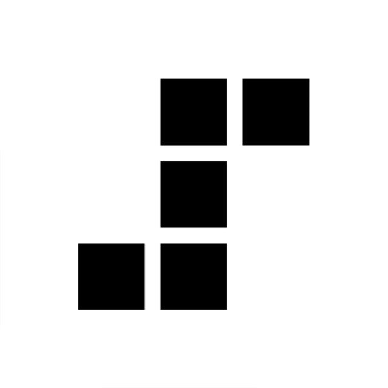 | StepFun | Oasis-Token do StepFun (cota do Coding Plan / Token Plan) | — | ✅ | — |
| 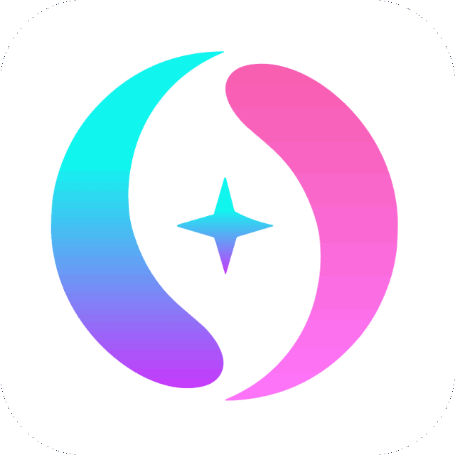 | APIs de terceiros | Predefinições de conta compatíveis com New API / Sub2API (incluindo forks compatíveis do One API), uma predefinição com chave de API da New API e um endpoint de saldo personalizado | — | ✅ | — |

<details>
<summary><strong>Notas, endpoints de saldo personalizados e caminhos de dados sobrescritos por variáveis de ambiente</strong></summary>

<br>

- Os caminhos acima são os padrões. O Token Monitor segue as mesmas sobrescritas de ambiente que o Tokscale — `$XDG_DATA_HOME` para as raízes `~/.local/share/` e variáveis por ferramenta como `$CODEX_HOME`, `$GROK_HOME`, `$HERMES_HOME`, `$KIMI_CODE_HOME`, `$UNSLOTH_STUDIO_HOME`, `$LM_STUDIO_HOME`, `$DSH_HOME`, `$REASONIX_STATE_HOME`, `$REASONIX_HOME` e a família `$CLINE_*`.
- O acompanhamento do LM Studio cobre atualmente requisições compatíveis com OpenAI `/v1/chat/completions` e `/v1/responses` registradas nos logs do servidor. Conversas iniciadas na interface de chat integrada do LM Studio e requisições nativas `/api/v1/chat` não são incluídas.
- O Unsloth Studio acompanha o uso de inferência a partir do `studio.db`: os chats do Studio e a sua API local. A inferência local tem custo de API zero; provedores medidos reconhecidos usam as estimativas de preço do Tokscale. Tokens de treinamento não são incluídos. Veja as [notas da origem do Unsloth](docs/providers/unsloth.md).
- O Devin acompanha as sessões do Devin CLI no `sessions.db` local e as sessões de agente do Devin Desktop nos logs ACP `acp-events`; quando ambos cobrem a mesma sessão, o banco do CLI é a fonte autoritativa. A cobertura do Desktop depende do agente ACP conectado: apenas agentes que gravam eventos `usage_update` localmente são contados, e o agente `devin-cloud` padrão do Devin Desktop mede o uso no servidor, então uma configuração padrão do Desktop não informa tokens do Desktop. Os títulos das sessões e a atribuição de projetos vêm do banco do CLI. Veja as [notas da origem do Devin](docs/providers/devin.md).
- O MiniMax Code lê o histórico local de sessões gravado pelo CLI em `~/.minimax` ou `MINIMAX_DATA_DIR` / `MAVIS_DATA_DIR` (também em `~/.mavis` e `~/.minimax-<profile>` / `~/.mavis-<profile>`), além das execuções capturadas com `tokscale headless mcode`; um turno encontrado nas duas fontes é contado uma única vez.

- As transcrições do Command Code não contêm contagens reais de tokens nem metadados de modelo por mensagem. O uso de tokens é estimado a partir do texto das transcrições, enquanto a atribuição de modelo e o custo derivado podem refletir o modelo configurado no momento, e não o modelo usado historicamente em cada requisição.
- O cache do Cursor vem da exportação de uso no nível da conta do Cursor, então cobre o uso do Cursor IDE, do Cursor CLI e do Grok Bot. O Token Monitor detecta automaticamente as contas com login pelo aplicativo desktop do Cursor e também permite adicionar contas manualmente nas Configurações. O cache ressincroniza sozinho quando fica desatualizado, mas sessões recém-concluídas podem levar alguns minutos para chegar ao painel do Cursor, então o uso é atualizado na sincronização, não na hora.

- O mapeamento personalizado associa campos JSON numéricos de um único endpoint GET de saldo; compatibilidade apenas com OpenAI ou Anthropic não é suficiente.
- O Qoder CN vem desativado por padrão; ative-o em Configurações → ferramentas. As sessões atuais são arquivos JSONL em `~/.qoder-cn/projects` (`TOKEN_MONITOR_QODER_CN_PROJECTS_PATH` e, depois, `QODERCN_CONFIG_DIR/projects`); versões mais antigas usavam um banco SQLite, sobrescrevível com `TOKEN_MONITOR_QODER_CN_DB_PATH`. Uma fonte ilegível mantém a última leitura completa. Sessões do banco legado registram apenas o nome do projeto, então aparecem sem projeto. Linhas JSONL faturadas por plano que informam créditos mas nenhuma contagem de tokens são omitidas dos totais de tokens; esses créditos permanecem nos Limites de Ferramentas de IA, e as linhas BYOK com tokens medidos são contadas. Veja as [notas da origem do Qoder](docs/providers/qodercn.md).
</details>

## Vitrine

<table>
<tr>
<td width="290" align="center"><br><sub>Painel personalizável — escolha quais módulos aparecem e em que ordem</sub></td>
<td width="290" align="center"><br><sub>Várias contas lado a lado e troca da conta ativa do Codex com um clique</sub></td>
<td width="290" align="center"><br><sub>Clique em qualquer ferramenta para expandir os detalhes de entrada / saída e acertos de cache</sub></td>
</tr>
<tr>
<td width="290" align="center"><br><sub>Abra uma sessão para decompor cada prompt em tokens e ferramentas usadas</sub></td>
<td width="290" align="center"><br><sub>Uso e custo de cada modelo, agregados entre todas as ferramentas</sub></td>
<td width="290" align="center"><br><sub>Uso, custo e status de sincronização de cada dispositivo — expanda para ver os detalhes por máquina</sub></td>
</tr>
</table>

<table>
<tr>
<td width="435" align="center"><br><sub>Um ano de mapa de calor de atividade e sequências, agregado entre todos os dispositivos</sub></td>
<td width="435" align="center"><br><sub>Um ano de tendências diárias, empilhadas por ferramenta / modelo, com linha K</sub></td>
</tr>
</table>

## Por que o Token Monitor?

A maioria dos monitores de uso só é útil na máquina em que roda. O Token Monitor foi feito para o trabalho multidispositivo: cada dispositivo observa seus próprios registros locais, envia resumos ao seu hub e todos os widgets conectados veem as mudanças de tokens quase imediatamente.

## Recursos

### Acompanhamento de uso

- **Rastreamento de tokens ao vivo** — Claude Code, Codex, Cursor, GitHub Copilot, Antigravity, OpenCode e 35+ ferramentas de IA, com a interface atualizando poucos segundos após cada turno (lista completa na tabela acima)
- **Taxa de tokens ao vivo** — uma leitura opcional da velocidade de geração em `tok/s` ou do consumo total em `tok/min`
- **Detalhes por sessão** — abra uma sessão para ver os tokens por prompt, expansível até a divisão exata de tokens de cada resposta e as ferramentas usadas (lido sob demanda de transcrições ou bancos locais, nunca sincronizado)
- **Estatísticas de acerto de cache** — clique em qualquer ferramenta ou modelo para expandir um detalhamento completo dos tokens de entrada (acerto no cache vs. fora do cache), tokens de saída e as porcentagens de acerto
- **Custo e moeda** — o custo ao lado das contagens de tokens, exibido em USD, TWD, HKD ou CNY; as taxas de câmbio são atualizadas automaticamente todos os dias e podem ser alteradas manualmente nas Configurações
- **Caminhos de verificação personalizados** — aponte uma ferramenta para pastas de sessões extras quando as suas estiverem fora dos locais padrão
- **WSL (Windows)** — o uso baseado em arquivos de uma distro WSL em execução é detectado automaticamente e mesclado a cada 5 minutos; ferramentas com backend SQLite, como OpenCode e Hermes, podem exigir um [agente headless dentro do WSL](docs/wsl-sqlite-setup.md)

### Limites, tendências e exportação

- **Detecção de Limites de Ferramentas de IA** — janelas de sessão, diária, semanal, de cobrança e de créditos específicas de cada provedor para Claude Code, Codex, Cursor, OpenRouter, APIs de terceiros, GLM, Kimi e 28+ provedores, incluindo vários perfis do OpenRouter/de terceiros e contas no estilo de saldo (créditos do Claude, saldo pré-pago e histórico de gastos do DeepSeek, saldos de terceiros)
- **Várias contas e troca do Codex** — acompanhe várias contas por provedor, cada uma com seus próprios limites; uma conta do Codex acompanhada pode ser definida como a conta local ativa com um clique, sem precisar autenticar de novo
- **Previsão de reset do Codex** — uma previsão opcional de terceiros abaixo dos limites do Codex, mostrando o horário previsto do reset, o tipo de reset (Regular ou Acumulado) e quando a janela fez o último reset
- **Preservar o uso de sessões excluídas** — muitas ferramentas eliminam sessões antigas (o Claude Code descarta transcrições após 30 dias por padrão), perdendo esse histórico. Quando ativado, o Token Monitor arquiva localmente o uso diário observado por ferramenta/modelo para que o mapa de calor e as tendências sobrevivam mesmo depois que os arquivos de origem sumirem (veja [Retenção de dados de sessão](#retenção-de-dados-de-sessão) abaixo)
- **Tendências de Uso e Painel** — um mapa de calor de atividade na tela inicial e um gráfico de tendências, além de uma janela de painel dedicada com sequências e histórico empilhado por ferramenta/modelo (visualizações em barra e linha K) em todos os seus dispositivos
- **Intervalos de uso fixos** — alterne entre Esta semana, Últimos 7 dias e Últimos 30 dias junto dos períodos nativos de dia, mês e total
- **Tela de Status opcional** — páginas de status do Claude, OpenAI, Cursor e DeepSeek, com reverificações manuais ou por intervalo
- **Exportação de dados** — exporte o uso como CSV + JSON independente de ferramenta, manualmente ou gravado automaticamente em uma pasta, para planilhas, Obsidian, Grafana ou scripts; veja [docs/export.md](docs/export.md)
- **Registros de assinaturas** — anote à mão quanto cada conta de IA realmente custa; a dica do rótulo do plano passa a informar o preço, a próxima renovação ou data de término, o tempo de assinatura e o custo de uso do mês como um múltiplo do que o plano custa, tanto para planos recorrentes quanto para livros-caixa de recargas

### Multidispositivo e implantação

- **Sincronização multidispositivo em tempo real** — a sincronização via hub usa Server-Sent Events para enviar atualizações a outros dispositivos em segundos; a sincronização pelo iCloud Drive é eventualmente consistente
- **Local-first** — nenhum servidor é necessário para uso em um único dispositivo
- **Backend de sincronização auto-hospedado** — hub dentro do widget, hub em CLI Node ou Cloudflare Worker
- **Suporte a widgets do iOS** — Widgy e Scriptable através do hub do Worker
- **Privacidade em primeiro lugar** — prompts, respostas, código-fonte e conteúdo dos arquivos ficam na sua máquina

### Interface e superfícies

- **Telas de detalhamento** — agrupadas por ferramenta, dispositivo, modelo, sessão, projeto ou limites da conta
- **Popover da barra de menus (macOS) e da bandeja do sistema (Windows)** — custo ao vivo, tokens ou o limite do provedor mais perto de acabar em %, ao lado do ícone
- **Modo Bolha Flutuante** — reduz o widget a uma mini-janela arrastável com prévia ao clicar ou passar o mouse e conteúdo no estilo da bandeja
- **Edge Dock (macOS e Windows)** — mantém cotas e uso na borda da tela, com modos de ocultar automaticamente, sempre visível ou ocultar em tela cheia. Os cartões ao passar o mouse mostram limites da conta, sessões recentes e uso de tokens. Escolha, reordene e configure itens nas Configurações e ative/desative pela barra de menus ou bandeja do sistema
- **Compositor de layout da barra de menus** — a barra de menus e a bolha flutuante podem usar uma predefinição embutida ou um layout montado por você: escolha "Personalizado…" para adicionar ícones de ferramentas de IA, barras de cota, porcentagens, horários de reset, custo, taxa de tokens ao vivo ou texto personalizado, arraste para reordenar com uma prévia ao vivo e dê a cada item sua própria ferramenta de IA, conta, janela de cota e fonte
- **Controles de aparência** — troca do tema da interface (inclusive um modo claro), cores por fornecedor de ferramenta, opacidade do vidro, desfoque, modo de janela transparente e fontes personalizadas
- **Widgets nativos do macOS** — veja uso de tokens e custo, tendências, cota restante das ferramentas de IA e horários de reset, mapas de calor de atividade e detalhamentos por ferramenta ou modelo nos layouts Pequeno, Médio e Grande no macOS 14+
- **Lista de ferramentas personalizável** — oculte, fixe e reordene ferramentas no painel principal sem alterar o que é acompanhado
- **Atalho global gravável** — mostre ou oculte a janela de qualquer lugar
- **Discord Rich Presence** — transmita os tokens de hoje, o custo e o cliente principal (opcional)

## Instalação

No macOS, instale pelo [Homebrew Cask](https://formulae.brew.sh/cask/token-monitor) oficial:

```bash
brew install --cask token-monitor
```

Ou baixe nas [GitHub Releases](https://github.com/Javis603/token-monitor/releases).

- **macOS (Apple Silicon)** — `.dmg`, assinado e notarizado
- **macOS (Intel)** — `.dmg` x64, assinado e notarizado
- **Windows 10/11** — `.exe` de instalação e portátil, [assinado digitalmente](docs/code-signing.md)
- **Linux x64** — `.AppImage`

As versões empacotadas verificam as GitHub Releases automaticamente. Quando há uma atualização disponível, o app mostra um indicador de atualização; nas plataformas suportadas também é possível instalar pelas Configurações → Geral.

### Primeira execução

O modo local é o padrão: abra o app e ele começa a acompanhar este dispositivo. Nenhum hub, agente ou configuração é necessário.

## Sincronização multidispositivo

Escolha UM backend de sincronização multidispositivo para os seus dispositivos (e para eventuais agentes headless). Em cada dispositivo, abra o widget e escolha um modo em Configurações → Sincronização multidispositivo. O widget contribui automaticamente com o uso deste dispositivo; execute `npm run agent` apenas em máquinas sem widget. O iCloud Drive é uma opção exclusiva do widget no macOS e não oferece suporte a agentes headless.

#### Opção A — Hospedar o hub a partir do widget (mais fácil, sem CLI)

No widget de uma máquina que fica sempre ligada, abra Configurações → Sincronização multidispositivo e escolha **Hospedar um hub neste dispositivo**. O widget gera um segredo aleatório e lista as URLs de rede local às quais os outros dispositivos podem se conectar (endereços do Tailscale ou do ZeroTier também aparecem aqui). Em todos os outros dispositivos, escolha **Conectar a um hub** e cole a URL e o segredo.

O hub fica ativo enquanto o Token Monitor estiver em execução — sair do aplicativo (não apenas fechar a janela) interrompe o hub para todos os dispositivos conectados.

#### Opção B — Hub Node auto-hospedado (máquina headless sempre ligada)

```bash
# on the always-on machine
cp .env.example .env
# set TOKEN_MONITOR_SECRET to something private, then:
npm run hub
```

#### Opção C — Hub no Cloudflare Worker (entre redes, inclusive iPhone)

[](https://deploy.workers.cloudflare.com/?url=https://github.com/Javis603/token-monitor/tree/main/worker)

Implantação com um clique — o Cloudflare vai pedir o `TOKEN_MONITOR_SECRET` durante a configuração. Ou implante manualmente:

```bash
cd worker
npm install
npx wrangler login
npx wrangler secret put TOKEN_MONITOR_SECRET
npx wrangler deploy
```

Cole a URL implantada no widget de cada dispositivo em Configurações → Sincronização multidispositivo. Veja [worker/README.md](worker/README.md) para a receita do widget do iOS e a referência de endpoints, ou [docs/API.md](docs/API.md) para a API HTTP do hub.

#### Opção D — iCloud Drive (macOS, sem servidor Hub)

Em cada Mac com login no mesmo Apple ID, escolha **iCloud Drive** em Configurações → Sincronização multidispositivo. Este é um caminho opcional exclusivo do macOS: o Token Monitor grava um snapshot atômico por dispositivo e um snapshot de assinaturas por escritor em `iCloud Drive/Token Monitor/sync-v1/`, e depois cada Mac agrega localmente os arquivos válidos. Não usa nenhum servidor do Token Monitor, CloudKit ou credenciais; as chaves de API dos provedores, cookies e tokens ficam locais. O iCloud Drive é eventualmente consistente, então outro Mac pode levar um instante para aparecer ou atualizar, e um arquivo ausente ou corrompido nunca limpa a última agregação válida.

## Dados do app

O estado do app fica no diretório de dados do usuário do sistema — apague-o junto com o app para desinstalar por completo.

| Plataforma | Caminho |
|----------|------|
| macOS | `~/Library/Application Support/Token Monitor/` |
| Windows | `%APPDATA%/Token Monitor/` |
| Linux | `~/.config/Token Monitor/` |

## Compilar a partir do código

Para compilar o seu próprio instalador, use Node.js 22.15+ no SO **de destino** (o electron-builder não consegue gerar um `.dmg` do macOS no Windows, nem o contrário).

```bash
npm install
npm run dist:mac     # macOS arm64 .dmg           → dist/
npm run dist:mac:x64 # macOS Intel x64 .dmg       → dist/
npm run dist:win     # Windows x64 installer .exe → dist/
npm run dist:linux   # Linux x64 AppImage         → dist/
npm run pack         # unpacked app dir (no installer), for quick local testing
```

A saída vai para `dist/`. Windows e Linux usam o script `dist:*` correspondente acima no SO de destino. Empacotar a versão de lançamento do macOS exige uma identidade de assinatura local do tipo Developer ID Application; use `npm start` para desenvolvimento local ou em plataformas sem suporte.

Os scripts de execução e de empacotamento garantem explicitamente o binário fixado do tokscale nos quatro alvos vendorizados. As demais plataformas de origem mantêm o binário do npm e filtram os clientes que ele não suporta; `npm install`, o lint e os testes não baixam esse binário.

## Como funciona

```text
Modo A — Local (padrão, sem configuração)
    widget (Electron) ──▶ tokscale ──▶ ~/.claude, ~/.codex, $HERMES_HOME

Modo B — Sincronização (opcional, multidispositivo)
    agente do dispositivo A ──▶
    agente do dispositivo B ──▶  hub  ──▶  widget em qualquer dispositivo
    agente do dispositivo C ──▶
```

O widget escolhe entre o modo local e o de sincronização com base em Configurações → Sincronização multidispositivo. O hub em si pode rodar como um processo `npm run hub` separado, como um Cloudflare Worker ou diretamente dentro de um dos widgets (modo Hospedar). Nos modos Cliente do Hub e Hospedar, o hub envia estatísticas agregadas a todos os widgets conectados via Server-Sent Events, então as atualizações de um dispositivo normalmente aparecem nos outros em poucos segundos. O modo iCloud Drive sincroniza os arquivos diretamente; a propagação é eventualmente consistente e pode demorar mais.

## Retenção de dados de sessão

Com **Preservar o uso de sessões excluídas** ativado (Configurações → Coleta), o Token Monitor arquiva localmente o uso diário observado por ferramenta/modelo, sem limite de tempo — de modo que, mesmo depois de uma ferramenta de origem eliminar as próprias sessões, o mapa de calor e as tendências não são afetados.

<details>
<summary><strong>Avançado: estender a retenção da própria ferramenta de origem</strong></summary>

<br>

O mapa de calor e o payload de sincronização usam uma janela móvel de 370 dias (as observações mais antigas permanecem disponíveis localmente para visualizações futuras). **O Claude Code mantém apenas 30 dias de transcrições por padrão** (`cleanupPeriodDays`); para manter o ano móvel completo antes que o arquivo entre em ação, aumente esse valor em `~/.claude/settings.json` antes que a janela passe:

```json
{
  "cleanupPeriodDays": 370
}
```

Um valor maior mantém mais dados, ao custo de deixar as transcrições no disco pelo tempo que você definir. A tabela [Session Data Retention](https://github.com/junhoyeo/tokscale#session-data-retention) do tokscale cobre os padrões e os caminhos de configuração das outras ferramentas.

Este arquivo cobre apenas os dias que o Token Monitor já observou; dados excluídos antes de ele começar a acompanhar não podem ser recuperados.

</details>

## Configurações

Há dois lugares para configurar o Token Monitor; o uso no dia a dia precisa apenas do primeiro:

- **Widget (interface gráfica)** — clique no botão `⚙` no canto inferior direito. Seções, na ordem: Geral (idioma, iniciar ao entrar no sistema, atualizações), Principal (módulos da Home e moeda de exibição), Janela (comportamento da janela, layout da barra de menus e da bolha flutuante, modo de bandeja, atalho), Aparência (tema e cores dos fornecedores), Coleta (ferramentas acompanhadas, frequência de coleta, Preservar o uso de sessões excluídas, exportação de dados), Limites de Ferramentas de IA (seleção de provedores, limites e credenciais), Assinaturas (o que você paga por conta) e Sincronização multidispositivo. O botão `⇧` na barra de título alterna o comportamento da janela.
- **Agente headless e hub** — sem interface; configurados por um arquivo `.env` na raiz do projeto (copie de `.env.example`), com precedência: flag de CLI → variável de ambiente → padrão interno.

Consulte a [referência de configuração](docs/configuration.md) para ver todas as configurações e todas as variáveis de ambiente.

## Privacidade

O Token Monitor processa os registros de uso localmente e não envia analytics nem telemetria ao mantenedor do projeto. O acesso à rede ocorre apenas para recursos documentados ou habilitados pelo usuário. Consulte a [política de privacidade](docs/privacy.md) para ver os dados usados pelas atualizações, pelas integrações de provedores, pelo Discord Rich Presence e pela sincronização multidispositivo opcional.

## Histórico de estrelas

<a href="https://github.com/Javis603/token-monitor/tree/star-history">
 <picture>
   <source media="(prefers-color-scheme: dark)" srcset="https://raw.githubusercontent.com/Javis603/token-monitor/star-history/star-history-dark.svg" />
   <source media="(prefers-color-scheme: light)" srcset="https://raw.githubusercontent.com/Javis603/token-monitor/star-history/star-history.svg" />
   
 </picture>
</a>

## Contribuindo

Issues e PRs são bem-vindos. As convenções do projeto, as notas de arquitetura e a referência de comandos ficam em [AGENTS.md](AGENTS.md) — escritos para agentes de programação, mas que também servem de guia para quem quer contribuir.

## Agradecimentos

- [tokscale](https://github.com/junhoyeo/tokscale) pela análise de logs e a contabilidade de tokens.
- [CodexBar](https://github.com/steipete/CodexBar) pela pesquisa sobre Limites de Ferramentas de IA.
- [Política de assinatura de código](docs/code-signing.md): assinatura de código gratuita fornecida pela [SignPath.io](https://signpath.io/), certificado pela [SignPath Foundation](https://signpath.org/).

## Licença

[MIT](LICENSE) © [@Javis](https://github.com/Javis603)
